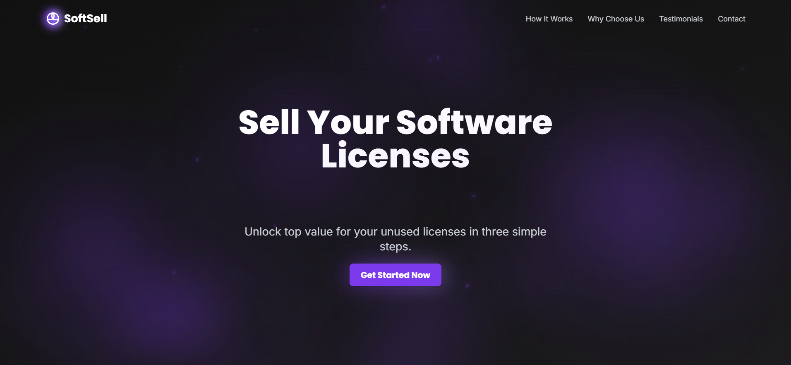

# SoftSell - Software License Resale Platform

A modern, responsive single-page marketing website for SoftSell, showcasing a software license resale platform with interactive animations and a chat interface.

## 🌟 Features

- Responsive dark theme UI with dynamic purple accents
- Interactive sections with parallax and card stack animations
- Real-time chat widget with predefined Q&A
- Client-side routing with React Router
- Form validation and submission handling
- Smooth scroll animations and transitions

## 🛠️ Tech Stack

- React 18 with TypeScript
- React Router DOM for client-side routing
- Vite for fast development and building
- Tailwind CSS for styling
- Framer Motion for animations
- React Hook Form for form handling
- React Toastify for notifications

## 🚀 Getting Started

1. Clone the repository:
   ```bash
   git clone https://github.com/yash-8923/soft-sell.git
   cd softsell
   ```

2. Install dependencies:
   ```bash
   npm install
   ```

3. Start the development server:
   ```bash
   npm run dev
   ```

4. Build for production:
   ```bash
   npm run build
   ```

## 📦 Deployment

The project is ready for deployment on platforms like Netlify, Vercel, or GitHub Pages.

### Important Notes for Deployment:
- The project uses client-side routing with React Router
- A `_redirects` file has been added for Netlify deployment to handle SPA routing
- For other hosting platforms, make sure to configure your server to redirect all routes to index.html

Example deploy commands:
```bash
# Build the project
npm run build

# Deploy to GitHub Pages (with gh-pages package)
npm install -g gh-pages
gh-pages -d dist
```

## 📱 Responsive Design

- Mobile-first approach
- Optimized for all screen sizes
- Tailwind breakpoints for consistent layouts
- Touch-friendly interactions

## ⚡ Performance

- Code splitting with React.lazy
- Client-side routing for faster page transitions
- Image optimization
- Efficient animations with Framer Motion
- Minimal dependencies

## 🎨 Design Elements

- Custom animations and transitions
- Gradient overlays and glowing effects
- Parallax scrolling
- Card stack animations
- Interactive hover states

## 📄 License

MIT License - feel free to use this project for personal or commercial purposes.

## 🤝 Contributing

Contributions are welcome! Please feel free to submit a Pull Request.